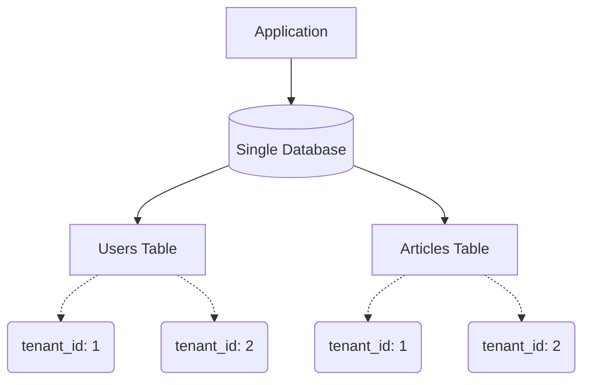
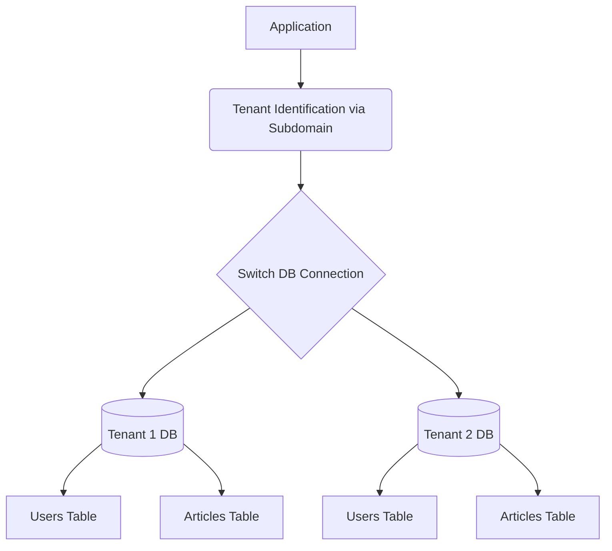

# Laravel Multi-Tenancy Course Documentation

This documentation provides a comprehensive, deep-dive overview of multi-tenancy concepts, approaches, and practical implementations in Laravel as covered in the course. It explores both custom implementations and package-based approaches (using `stancl/tenancy`), mapping directly to the four course modules.

## Table of Contents

1. [Concepts and Terminologies](#1-concepts-and-terminologies)
2. [Multi-Tenancy Benefits](#2-multi-tenancy-benefits)
3. [Multi-Tenancy Approaches](#3-multi-tenancy-approaches)
4. [Module 1: Custom Single Tenancy](#4-module-1-custom-single-tenancy)
5. [Module 2: Custom Multi Tenancy](#5-module-2-custom-multi-tenancy)
6. [Module 3: Package (stancl/tenancy) Multi Tenancy](#6-module-3-package-stancltenancy-multi-tenancy)
7. [Module 4: Package (stancl/tenancy) Single Tenancy](#7-module-4-package-stancltenancy-single-tenancy)

---

## 1. Concepts and Terminologies

- **Tenant**: A customer, organization, or user group that shares a single instance of a software application.
- **Multi-Tenancy**: An architecture in which a single instance of a software application serves multiple customers (tenants). Each tenant's data is isolated and remains invisible to other tenants.
- **Data Isolation**: Ensuring that one tenant cannot access the data belonging to another tenant.
- **Global Scope**: A Laravel Eloquent feature that allows you to automatically apply specific constraints to all queries for a given model (e.g., automatically filtering data by `tenant_id`).
- **Central Domain**: The primary domain of the application used for administrative purposes or landing pages, as opposed to tenant-specific subdomains.

## 2. Multi-Tenancy Benefits

- **Cost Efficiency**: Sharing resources and infrastructure among multiple tenants reduces overall costs.
- **Easier Maintenance**: Updates and patches only need to be applied once to the shared application instance.
- **Scalability**: Scaling a single central application is often easier than managing hundreds of separate instances.
- **Centralized Data Management**: Easier to gather global metrics and analytics across all tenants (specifically in single DB setups).

## 3. Multi-Tenancy Approaches

There are primarily two ways to handle databases in multi-tenancy:

### Single Database (Row-Level Security)
All tenants share the same database and the same tables. A `tenant_id` column is added to every table to filter data per tenant.



### Multi Database (Database-Level Security)
Every tenant has their own separate database. The application dynamically switches the database connection based on the current tenant.



---

## 4. Module 1: Custom Single Tenancy

This module covers building a single-database multi-tenant application from scratch without relying on external packages.

### Database Adjustments
To support single tenancy, all tenant-aware tables must have a foreign key linking them to a central `tenants` table.

```php
// database/migrations/...add_tenant_id_users_table.php
Schema::table('users', function (Blueprint $table) {
    $table->foreignId('tenant_id')
        ->after('id')
        ->constrained('tenants')
        ->cascadeOnDelete();
});
```

### Registration Logic
During registration, we first check or create a `Tenant`, then we assign the newly registered user to that tenant using `tenant_id`.

```php
// app/Http/Controllers/Auth/RegisteredUserController.php
$tenant = Tenant::query()->firstOrCreate([
    'name' => $request->tenant,
]);

$user = User::query()->create([
    'name' => $request->name,
    'email' => $request->email,
    'tenant_id' => $tenant->id,
    'password' => Hash::make($request->password),
]);
```

### Scopes and Traits for Data Isolation
To enforce isolation, a custom `Tenantable` trait is used along with a Scope to automatically inject the `tenant_id` into queries and inserts.

```php
// app/Traits/Tenantable.php
namespace App\Traits;

use App\Models\Tenant;
use Illuminate\Database\Eloquent\Attributes\Scope;
use Illuminate\Database\Eloquent\Builder;
use Illuminate\Database\Eloquent\Model;

trait Tenantable
{
    public function tenant()
    {
        return $this->belongsTo(Tenant::class);
    }

    #[Scope]
    public function ForTenant(Builder $query, $tenant_id)
    {
        return $query->where('tenant_id', $tenant_id);
    }

    protected static function bootTenantable(): void
    {
        static::creating(function (Model $model) {
            $model->tenant_id = auth()->user()->tenant_id;
        });
    }
}
```

### Displaying Data
When retrieving records for a view, the `ForTenant` scope is used.
```php
// routes/web.php
Route::get('/dashboard', function () {
    return view('dashboard', [
        'users' => User::query()->ForTenant(auth()->user()->tenant_id)->get(),
    ]);
})->name('dashboard');
```

---

## 5. Module 2: Custom Multi Tenancy

This approach leverages a central database to store tenant information and separate databases for each tenant's specific data.

### Database Setup
The central database holds a `tenants` table containing standard data alongside configuration fields like `subdomain` and `database` name. Tenant-specific migrations (like `users` and `articles` tables) are segregated into a specific directory (`database/migrations/tenant`).

### Registration & Database Creation
When a user registers and provides a tenant name, the application dynamically creates a database string and uses raw DB queries to create the schema.

```php
// app/Http/Controllers/Auth/RegisteredUserController.php
if ($request->tenant) {
    $tenantName = $request->tenant;
    $tenant = Tenant::query()->create([
        'name' => $tenantName,
        'subdomain' => str_replace(' ', '-', $tenantName) . '.multitenancycustom.test',
        'database' => $databaseName = str_replace(' ', '_', $tenantName),
        'user_id' => $user->id,
    ]);

    // Create new database for tenant
    (new TenantDatabaseService())->createDB($databaseName);
}
```

### Tenant Middleware
This middleware intercepts incoming requests. If the request originates from a tenant subdomain rather than the central domain, it identifies the tenant and dynamically switches the database connection.

```php
// app/Http/Middleware/TenantMiddleware.php
public function handle(Request $request, Closure $next)
{
    $subDomain = $request->getHost();
    $isTenant = !Str::contains('multitenancycustom.test', $subDomain);
    
    if ($isTenant) {
        $tenant = Tenant::query()->where('subdomain', $subDomain)->first();
        if (!$tenant) {
            abort(400, 'Subdomain not found');
        }
        if (config('database.connections.tenant.database') !== $tenant->database) {
            (new TenantDatabaseService())->connectToDatabase($tenant);
            (new TenantDatabaseService())->migrateToDB($tenant);
        }
    }
    return $next($request);
}
```

### Database Connection Switching
The `TenantDatabaseService` creates the DB on registration, configures the runtime connection via `Config::set()`, purges the default connection, and reconnects to the specific tenant schema.

```php
// app/Services/TenantDatabaseService.php
public function connectToDatabase(Tenant $tenant)
{
    $databaseName = $tenant->database;
    Config::set('database.connections.tenant.database', $databaseName);
    DB::purge('mysql');
    DB::reconnect('tenant');
    Config::set('database.default', 'tenant');
}
```

---

## 6. Module 3: Package (`stancl/tenancy`) Multi Tenancy

Using the popular `stancl/tenancy` package drastically simplifies a multi-database approach by taking care of connection swapping, domain identification, and background routing.

### Key Configurations and Code

**1. Central Domains Configuration**
The central domains are defined to ensure tenant middleware ignores the master domain.

```php
// config/tenancy.php
'central_domains' => [
    'laraveltenancymultipackage.test',
    '127.0.0.1',
    'localhost',
],
```

**2. Tenant Model Setup**
The package provides a base Tenant model that we extend to use its built-in Database and Domain traits.

```php
// app/Models/Tenant.php
class Tenant extends BaseTenant implements TenantWithDatabase
{
    use HasDatabase, HasDomains;
    
    public static function getCustomColumns(): array
    {
        return ['id', 'name', 'user_id'];
    }
}
```

**3. Vite Bundling Feature**
The package provides features to handle static assets seamlessly across subdomains without causing pathing issues. This must be uncommented in the `features` array.

```php
// config/tenancy.php
'features' => [
    Stancl\Tenancy\Features\ViteBundler::class,
],
```

**4. Route Isolation**
Tenant specific routes are housed completely separate from central application routes.

```php
// routes/tenant.php
Route::middleware([
    'web',
    \Stancl\Tenancy\Middleware\InitializeTenancyBySubdomain::class,
    PreventAccessFromCentralDomains::class,
])->group(function () {
    // Tenant routes go here...
});
```

**5. Registration Logic**
During registration, domains are chained to the Tenant model, enabling subdomains instantaneously via the package configuration.

```php
// app/Http/Controllers/Auth/RegisteredUserController.php
$tenant = Tenant::create([
    'name' => $request->tenant,
    'user_id' => $user->id,
    'id' => $request->tenant
]);
$tenant->domains()->create([
    'domain' => $request->tenant
]);
```

---

## 7. Module 4: Package (`stancl/tenancy`) Single Tenancy

The `stancl/tenancy` package can also be adapted to power a single-database setup.

### Key Configurations and Code

**1. Bootstrappers Modification**
For single DB architecture using the package, the Database Bootstrapper is omitted as we are not switching database connections, but rather relying on custom scope logic.

```php
// config/tenancy.php
'bootstrappers' => [
    // Stancl\Tenancy\Bootstrappers\DatabaseTenancyBootstrapper::class, // Disabled for Single DB
    Stancl\Tenancy\Bootstrappers\CacheTenancyBootstrapper::class,
    Stancl\Tenancy\Bootstrappers\FilesystemTenancyBootstrapper::class,
    Stancl\Tenancy\Bootstrappers\QueueTenancyBootstrapper::class,
],
```

**2. Registration Integration**
When dealing with a Single Database package structure, user accounts can either fall under a completely new domain/tenant, or they can latch onto the *current active* tenant utilizing the `tenant('id')` helper.

```php
// app/Http/Controllers/Auth/RegisteredUserController.php
if ($request->has('tenant')) {
    $tenant = Tenant::query()->firstOrCreate(['id' => $data['tenant']]);
    if ($tenant->domains()->where('domain', $data['tenant'])->doesntExist()) {
        $tenant->domains()->create([
            'domain' => $data['tenant']
        ]);
    }
}
$user = User::create([
    'name' => $request->name,
    'email' => $request->email,
    'password' => Hash::make($request->password),
    'tenant_id' => $request->has('tenant') ? $tenant->id : tenant('id'),
]);
```

**3. Tenant Model & Traits**
While the `Tenant.php` model retains `HasDomains`, the actual heavy lifting for data isolation on user models is achieved through injecting the active tenant ID, bypassing physical database segmentation.

---
*End of Documentation*
